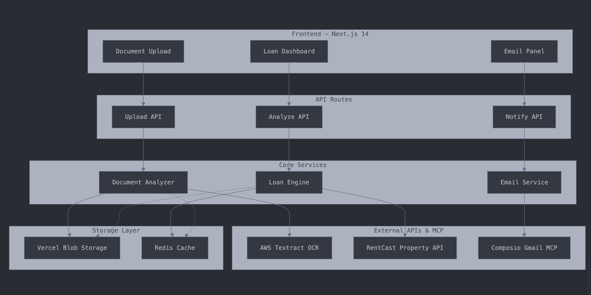

## LoanLens – Mortgage Document Intelligence

LoanLens is a Next.js application that processes mortgage documents with AI to deliver instant loan assessments, property valuation, and automated email notifications. It stitches together file uploads, AI-powered parsing, financial metric computation, and lender notifications into a clean dashboard experience.

### Architecture


### Key Features
- AI-powered PDF parsing (OpenAI Responses API) from a Vercel Blob URL
- Property valuation and recent price history (RentCast)
- Financial metrics (LTV, DTI, PITI) and eligibility assessment with suggestions
- Automated Gmail notifications via Composio Gmail MCP (approval/conditional)
- Persistent storage in Upstash Redis: surface latest analysis and email history
- Reactive dashboard with Zustand state hydration on page load

### Tech Stack
- Frontend: Next.js (App Router), React 18, TypeScript, Tailwind CSS, shadcn/ui
- State: Zustand
- Forms/Validation: React Hook Form, Zod
- Charts: Recharts
- Storage: Vercel Blob (file uploads)
- Cache/DB: Upstash Redis
- AI: OpenAI Responses API (gpt-4o-mini)
- Email: Composio Gmail MCP
- Property Valuation: RentCast API

---

## Getting Started

First, run the development server:

```bash
npm run dev
# or
yarn dev
# or
pnpm dev
# or
bun dev
```

Open [http://localhost:3000](http://localhost:3000) with your browser to see the result.

### Environment Variables
Create a .env file at the project root with the following (adjust as needed):

```env
# Public App URL
NEXT_PUBLIC_APP_URL=http://localhost:3000

# OpenAI
OPENAI_API_KEY=your_openai_key

# Composio Gmail MCP
COMPOSIO_API_KEY=your_composio_api_key
GMAIL_USER_EMAIL=your_gmail_address@example.com
# If you use a pre-authorized account flow
GMAIL_AUTH_KEY=your_gmail_auth_key
# Optional: A default connected account id/user id if you maintain one
USER_ID=your_composio_user_id

# Vercel Blob
BLOB_READ_WRITE_TOKEN=your_vercel_blob_token

# Upstash Redis
UPSTASH_REDIS_URL=your_upstash_url
UPSTASH_REDIS_TOKEN=your_upstash_token

# RentCast
RENTCAST_API_KEY=your_rentcast_key

# Optional AWS Textract fallback
AWS_REGION=your_aws_region
AWS_ACCESS_KEY_ID=your_access_key
AWS_SECRET_ACCESS_KEY=your_secret_key
```

### Production Build
```bash
npm run build
npm run start
```

## How It Works (High Level)
1. Upload documents via the dashboard. Files are stored to Vercel Blob and a public URL is produced.
2. Server analyzes from URL using OpenAI Responses API and returns structured data.
3. Property valuation and sales history are fetched from RentCast (with in-memory memoization in the service layer).
4. Financial metrics and eligibility are computed, recommendations are generated.
5. Results are persisted to Upstash (`analysis:latest`, `analysis:history`).
6. The dashboard hydrates Zustand state from `/api/analysis/latest` on load and shows results.
7. Email notifications can be sent (approval/conditional) via Composio; results are persisted to Upstash (`emails:history`) and rendered in the Notifications tab on load.

### Primary API Routes
- `POST /api/documents/analyze` – Save to Vercel Blob, analyze from URL, persist to Upstash
- `GET /api/analysis/latest` – Latest analysis object for dashboard hydration
- `GET /api/property-valuation` – Property AVM + price history
- `POST /api/notifications/send-approval` – Send approval email, save to Upstash history
- `POST /api/notifications/send-conditional` – Send conditional email, save to Upstash history
- `GET /api/notifications/history` – Fetch recent email notifications

---

## Suggested Test Documents
- Mortgage application (URLA), pay stubs, bank statements, tax returns, loan estimate PDFs.
- Any structured mortgage docs that contain borrower info, loan amount, rate, etc.

If OpenAI parsing misses fields, the app applies sensible fallbacks (e.g., default borrower email, bounded credit score, synthetic price trend) so the UI remains complete.

---

## Troubleshooting
- Multiple lockfiles warning: remove either `yarn.lock` or `package-lock.json` to avoid the notice.
- Composio Gmail: ensure the connected Gmail account is active. The server will attempt to initialize the connection; check server logs if authorization is required.
- Upstash JSON errors: this repo safely parses values, but ensure you don’t manually write non-JSON strings into JSON keys.
- Vercel Blob: ensure `BLOB_READ_WRITE_TOKEN` is set; otherwise uploads will fail.

---

## Scripts
- `npm run dev` – Start the dev server
- `npm run build` – Type-check, lint and build
- `npm run start` – Start production server

---

## Notes
- State is centralized in `lib/store/app-store.ts` (Zustand) and hydrated by the dashboard on mount.
- Email history is persisted to Upstash (`emails:history`) and rendered in the Notifications tab.
- The OpenAI model used is `gpt-4o-mini`; adjust in `lib/document-parsers/openai-pdf-parser.ts` if needed.

To learn more about Next.js, take a look at the following resources:

- [Next.js Documentation](https://nextjs.org/docs) - learn about Next.js features and API.
- [Learn Next.js](https://nextjs.org/learn) - an interactive Next.js tutorial.

You can check out [the Next.js GitHub repository](https://github.com/vercel/next.js) - your feedback and contributions are welcome!

## Deploy on Vercel

The easiest way to deploy your Next.js app is to use the [Vercel Platform](https://vercel.com/new?utm_medium=default-template&filter=next.js&utm_source=create-next-app&utm_campaign=create-next-app-readme) from the creators of Next.js.

Check out our [Next.js deployment documentation](https://nextjs.org/docs/app/building-your-application/deploying) for more details.
